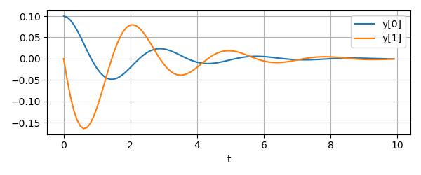

# dyn-opt
Various Python tools for non-linear function approximation, [system identification][2] 
and [dynamic optimization][3].

## Contents

1. Models

    - [dynopt.models.models](src/dynopt/models/models.py) - Models for running model estimation and evaluation experiments with data
    - [dynopt.models.sindy](src/dynopt/models/sindy.py) - Sparse non-linear identification algorithm (SINDy)

2. Data processing utilities

    - [dynopt.preprocessing.utils](src/dynopt/preprocessing/utils.py) - Functions for processing time-series data in preparation for model-fitting.
    - [dynopt.preprocessing.sim_utils](src/dynopt/preprocessing/sim_utils.py) - Class for real-time data capture and visualization (TODO: move this into utils.py).


## 1. Model Fitting

The [Model](https://github.com/billtubbs/dyn-opt/blob/master/src/dynopt/models/models.py#L28) class and its sub-classes provide convenient
interfaces for running model estimation and evaluation experiments with [Scikit-learn](https://scikit-learn.org/stable/) estimators.  They help you generate and fit models to data stored in [Pandas dataframes](https://pandas.pydata.org/pandas-docs/stable/reference/api/pandas.DataFrame.html) and also make it easier to reliably
use the fitted models for online prediction.

Because data in a Pandas dataframe is labelled, the models can be configured to use
specific data inputs while ignoring other data that is not relevant.  This means you 
can automate model design, testing and evaluation with different inputs and outputs,
without having to worry about re-sizing and matcing the data sets to each model.
Instead, you can pass all the data to each model and it will only use the fields
it was intended for.

The models also allow you to specify additional calculated input features which are
automatically calculated prior to model-fitting using the Pandas [`DataFrame.eval`](https://pandas.pydata.org/pandas-docs/stable/reference/api/pandas.DataFrame.eval.html#pandas-dataframe-eval) method.  
This allows you to define non-linear features as expressions (see the nonlinear model 
fitting example below).

The following table summarizes the three main classes of models.

| Model       | Data input/output type | Selectable inputs/outputs | Calculated inputs | Sparse model identification |
| ----------- | :--------------------: | :-----------------------: | :---------------: | :-------------------------: | 
| `Model` | DataFrame  | Yes  | No  | No  |
| `NonLinearModel` | DataFrame  | Yes  | Yes  | No   |
| `SparseNonLinearModel`  | DataFrame  | Yes  | Yes  | Yes  |

The following examples illustrate how these three model types can be used.


### Example 1 - Linear Regression with a Subset of Features

For this example we download the Boston housing price dataset:

```python
from sklearn.datasets import fetch_california_housing

# Load dataset
data = fetch_california_housing()

# Define data names
feature_names = data.feature_names
target_name = 'MedHouseVal'  # Median value of homes in $1000s
```

First, put the data into Pandas dataframes with appropriate column names:

```python
X = pd.DataFrame(data.data, columns=feature_names)
y = pd.DataFrame(data.target, columns=[target_name])

print(X.head)
```

```
   MedInc  HouseAge  AveRooms  AveBedrms  Population  AveOccup  Latitude  \
0  8.3252      41.0  6.984127   1.023810       322.0  2.555556     37.88   
1  8.3014      21.0  6.238137   0.971880      2401.0  2.109842     37.86   
2  7.2574      52.0  8.288136   1.073446       496.0  2.802260     37.85   
3  5.6431      52.0  5.817352   1.073059       558.0  2.547945     37.85   
4  3.8462      52.0  6.281853   1.081081       565.0  2.181467     37.85   

   Longitude  
0    -122.23  
1    -122.22  
2    -122.24  
3    -122.25  
4    -122.25  
```

The input (x) and output (y) data that you want to use can now be identified by 
the column names when initializing the model:

```python
# Select desired inputs and outputs
x_names = ['MedInc', 'HouseAge', 'AveRooms']
y_names = [target_name]

# Initialize model
model = Model(x_names, y_names)  # by default uses a linear estimator
print(model)
```

```
Model(['MedInc', 'HouseAge', 'AveRooms'], ['MedHouseVal'], estimator=LinearRegression())
```

The model is then fitted in a similar way to Scikit-Learn models except that
the whole data set can now be passed to the model and it will only use the data 
columns it requires.

```python
# Fit model
model.fit(X, y)

# Fit score (R-squared)
print(model.score(X, y))
```

There is currently a bug!

```
ValueError: The feature names should match those that were passed during fit.
Feature names unseen at fit time:
- x0
- x1
- x2
Feature names seen at fit time, yet now missing:
- AveRooms
- HouseAge
- MedInc
```

Looks like scikit-learn implemented a form of feature names which is what
this library does!  So it will need re-writing and maybe take advantage
of this new feature.

### TODO: Update below once code working

Likewise, when predicting with the fitted model, only the relevant input data is 
used by the model.  The predicted output is a dataframe:

```python
print(model.predict(X.head()))

#         MEDV
# 0  29.012111
# 1  26.263785
# 2  33.059827
# 3  32.819835
# 4  32.273937
```

Faster, single-point prediction using dictionaries is also supported:

```python
x = {'LSTAT': 4.98, 'RM': 6.575, 'TAX': 296}
print(model.predict(x))

# {'MEDV': 29.01211141973685}
```

### Example 2 - Non-Linear Model Estimation

The `NonLinearModel` class in [models.py](/dynopt/models/models.py) allows you to specify features
as calculated expressions of the input data.

The next two examples demonstrate how to use this feature to identify the 
non-linear dynamics of a simple pendulum from data.

First we generate data by simulating a pendulum with two ordinary differential 
equations describing its motion:

```python
import numpy as np

def pendulum_dydt(t, y):
    dydt = np.empty_like(y)
    dydt[0] = y[1]
    dydt[1] = -y[1] - 5*np.sin(y[0])
    return dydt
```

Integrate dy/dt over time:

```python
from scipy.integrate import odeint

t = np.arange(0, 10, 0.1)
y0 = [np.pi+0.1, 0]  # Initial condition
y = odeint(pendulum_dydt, y0, t, tfirst=True)
assert y.shape == (100, 2)
```

The plot below shows how the pendulum states vary over time.



Next, compute the derivatives that we want to predict:

```python
# Calculate dydt values
dydt = pendulum_dydt(t, y)
assert dydt.shape == (100, 2)
```

Initialize a non-linear estimation model with appropriate inputs and outputs:

```python
from dynopt.models.models import NonLinearModel

# Labels for inputs and outputs
x_names = ['theta', 'theta_dot']
y_names = ['theta_dot', 'theta_ddot']

# Choose input features including non-linear terms
x_features = ['x1', 'sin(x0)']

# Initialize model
model = NonLinearModel(x_names, y_names, x_features=x_features)
```

Prepare pandas dataframes with the same names containing the input and output 
data:

```python
y = pd.DataFrame(dydt, columns=y_names)
X = pd.DataFrame(y, columns=x_names)
print(y.head())

#       theta  theta_dot
# 0  0.100000   0.000000
# 1  0.097595  -0.047109
# 2  0.090802  -0.087513
# 3  0.080359  -0.119943
# 4  0.067106  -0.143621

print(dydt.head())

#    theta_dot  theta_ddot
# 0   0.000000   -0.499167
# 1  -0.047109   -0.440093
# 2  -0.087513   -0.365874
# 3  -0.119943   -0.281420
# 4  -0.143621   -0.191657
```

Fit the model to the data and display the coefficients.

```python
model.fit(y, dydt)
print(model.coef_.round(5))

#      x1  sin(x0)
# y0  1.0     -0.0
# y1 -1.0     -5.0
```

Note that the estimated coefficients are very close to the coefficients in the 
original system equations above.


### Example 3 - Sparse Identification of Non-linear Dynamics

The [Sparse Identification of Non-linear Dynamics algorithm (SINDy)][1] is a numerical 
technique that automatically identifies unknown non-linear relationships when the 
governing equations of the system are sparse (i.e. when they have a few dominant terms).  
When this is the case, the SINDy algorithm finds a sparse approximation of the true 
dynamics.

Here, we use same data as in the previous example but this time we assume that we don't 
exactly know the terms in the underlying equations.  Instead, we specify a polynomial
model order that we think will capture the true dynamics (2nd order here) as well as
any additional non-linear terms we think may exist (e.g. sine, cosine functions).

The `SparseNonLinearModel` class constructs a data library for all possible polynomial
terms (`x0`, `x1`, `x0*x1`, `x0**2`, `x1**2`, ... etc.) as well as any additional terms 
specified, and then uses an iterative least-squares procedure to recursively eliminate 
terms that are not significant.  

A threshold parameter determines how many terms are eliminated:

```python
from dynopt.models.models import SparseNonLinearModel

# Choose additional non-linear features for model identification
custom_features = ['sin(x0)', 'cos(x0)', 'sin(x0)**2', 
                   'cos(x0)**2', 'sin(x0)*cos(x0)']

# Initialize SINDy model
model = SparseNonLinearModel(x_names, y_names, 
                             custom_features=custom_features,
                             poly_order=2)
```

Fit model (implements SINDy sparsification procedure):

```python
threshold = 0.2  # Sparsity parameter
model.fit(y, dydt, threshold=threshold)
print(model.n_params)
# 3
```

Display fitted model coefficients:

```python
print(model.coef_)

#      x1  sin(x0)
# y0  1.0      0.0
# y1 -1.0     -5.0
```

Again, if you look at the original governing equations above, you can see that it 
has identified the correct terms as well as the coefficients exactly.

### References

The SINDy code in this package is based on the methods and code provided in the book 
[Data-Driven Science and Engineering: Machine Learning, Dynamical Systems, and Control (1st ed.) by Brunton, S. L., & Kutz, J. N. (2019)][1].

The following notebooks show how to replicate two of the examples in the book using 
the code in this repository:

1. [Sparse-Identification-with-SINDy-on-Lorenz-system.ipynb](Sparse-Identification-with-SINDy-on-Lorenz-system.ipynb) 
  A demonstration of SINDy identifying the Lorenz system 
2. [Sparse-Identification-with-SINDy-on-Lorenz-system-with-control.ipynb](Sparse-Identification-with-SINDy-on-Lorenz-system-with-control.ipynb)
  A demonstration of SINDYc identifying the forced Lorenz system
3. See [sindy.py](dynopt/models/sindy.py) for least-squares implementation used in this repository.

There is also an [official PySindy package][4] developed by Brian de Silva et al. at the University of Washington for implementing SINDy which contains some additional features.

[1]: http://www.databookuw.com
[2]: https://en.wikipedia.org/wiki/System_identification
[3]: https://en.wikipedia.org/wiki/Control_(optimal_control_theory)
[4]: https://github.com/dynamicslab/pysindy


## 2. Data Preprocessing

### Data Logger

The [`DataLogger`](https://github.com/billtubbs/dyn-opt/blob/559724d412f8720e7b5e0b85fe3e917a0d4db158/src/dynopt/preprocessing/sim_utils.py#L6C7-L6C17) class in [sim_utils.py](src/dynopt/preprocessing/sim_utils.py) is useful for real-time data acquisition and dynamic model calculations.  It contains a Pandas dataframe that is initialized with a time-step index named 'k' and time instances 't' and let's you append data sequentially. You can specify the length of the dataframe (`nT_max = 100` rows by default), and when it is full it will scroll the data, aways keeping the previous `nT_max` rows.

#### Basic usage

```python
from dynopt.preprocessing.sim_utils import DataLogger

dl = DataLogger(columns=['u', 'x', 'y'])
print(dl.data.shape)
print(dl.data.head())
```

```text
(100, 4)
    t   u   x   y
k                
0 NaN NaN NaN NaN
1 NaN NaN NaN NaN
2 NaN NaN NaN NaN
3 NaN NaN NaN NaN
4 NaN NaN NaN NaN
```

```python
dl.append({'t': 0.0, 'u': 1.0, 'x': 0.5, 'y': 2.0})
print(dl.data.head())
```

```text
     t    u    x    y
k                    
0  0.0  1.0  0.5  2.0
1  NaN  NaN  NaN  NaN
2  NaN  NaN  NaN  NaN
3  NaN  NaN  NaN  NaN
4  NaN  NaN  NaN  NaN
```

Example of setting up a logger with pre-history.

```python
initial_values = {'u': 0, 'x': 0, 'y': 0}
dl = DataLogger(initial_values, index=[-2, -1, 0], sample_time=1.5, nT_max=10)
print(dl.data)
```

```text
-2 -3.0  0.0  0.0  0.0
-1 -1.5  0.0  0.0  0.0
0   0.0  0.0  0.0  0.0
1   NaN  NaN  NaN  NaN
2   NaN  NaN  NaN  NaN
3   NaN  NaN  NaN  NaN
4   NaN  NaN  NaN  NaN
5   NaN  NaN  NaN  NaN
6   NaN  NaN  NaN  NaN
7   NaN  NaN  NaN  NaN
```

Note that in this case it pre-populated the dataframe with the initial-values and computed the time values (`t`).

This is useful when you want to simulate an auto-regressive model for example:
```python
x = dl.data['x']
y = dl.data['y']
input_data = [
    [1.5, 1.0],
    [3.0, 1.0],
    [4.5, 1.0],
    [6.0, 1.0],
    [6.5, 1.0]
]
for t, uk in input_data:
    dl.append({'t': t, 'u': uk})
    k = dl.k
    x[k] = 0.3 * x[k-1] + 0.2 * x[k-2] + 0.5 * uk
    y[k] = 2.0 * x[k]
print(dl.data)
```

```text
      t    u        x       y
k                            
-2 -3.0  0.0  0.00000  0.0000
-1 -1.5  0.0  0.00000  0.0000
0   0.0  0.0  0.00000  0.0000
1   1.5  1.0  0.50000  1.0000
2   3.0  1.0  0.65000  1.3000
3   4.5  1.0  0.79500  1.5900
4   6.0  1.0  0.86850  1.7370
5   6.5  1.0  0.91955  1.8391
6   NaN  NaN      NaN     NaN
7   NaN  NaN      NaN     NaN
```

### Data Pre-processing tools

[utils.py](dynopt/preprocessing/utils.py) contains a variety of functions commonly used for 
preprocessing time-series data in preparation for fitting dynamic models.

 - `split_name(name)`
 - `t_inc_str(inc)`
 - `name_with_t_inc(name, inc)`
 - `add_timestep_indices(data, cols=None)`
 - `var_name_sequences(names, t0, tn, step=1)`
 - `add_previous_or_subsequent_value(data, n, cols=None, prev=False, dropna=False)`
 - `add_subsequent_values(data, n=1, cols=None, dropna=False)`
 - `add_previous_values(data, n=1, cols=None, dropna=False)`
 - `add_differences(data, n=1, cols=None, dropna=False, sub='_m')`
 - `add_rolling_averages(data, window_length, cols=None, dropna=False, sub='_ra')`
 - `add_filtered_values_savgol(data, window_length, polyorder, cols=None, dropna=False, pre='', sub='_sgf', *args, **kwargs)`
 - `add_derivatives_savgol(data, window_length, delta, polyorder=2, cols=None, dropna=False, pre='d', sub='/dt_sgf', *args, **kwargs)`
 - `add_ewmas(data, cols=None, dropna=False, alpha=0.4, sub='_ewma', *args, **kwargs)`
 - `polynomial_features(y_in, order=3)`
 - `polynomial_feature_labels(n_vars, order, names=None, vstr='x', psym='**')`
 - `feature_dataframe_from_expressions(data, expressions)`
 - `feature_array_from_expressions(data, expressions)`
 
Please refer to the docstrings in [dynopt/preprocessing/utils.py](dynopt/preprocessing/utils.py)
for details on these functions.
